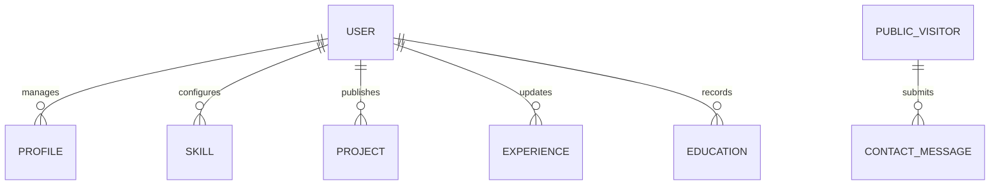

# Database Schema & Data Models Documentation

This document outlines the MongoDB collections, schema definitions, field data types, validations, default values, and indexing strategies utilized across the portfolio system.

---

## 1. Entity Relationship Overview



---

## 2. Collection Schemas

### 2.1 `users` Collection

Stores administrative login credentials.

| Field Name | Type | Required | Default / Constraints | Description |
| :--- | :--- | :--- | :--- | :--- |
| `_id` | `ObjectId` | Auto | Unique primary key | Document Identifier |
| `name` | `String` | Yes | Trimmed | Administrator Name |
| `email` | `String` | Yes | Unique, Lowercase, Trimmed | Login Email |
| `password` | `String` | Yes | Bcrypt Hash (salt factor 10) | Hashed Credential |
| `role` | `String` | Yes | Enum: `['admin', 'user']`, Default: `'admin'` | Access Role |
| `createdAt` | `Date` | Auto | Mongoose Timestamp | Record creation timestamp |
| `updatedAt` | `Date` | Auto | Mongoose Timestamp | Record update timestamp |

**Example Document:**
```json
{
  "_id": "67b4474744d0df27ef21a001",
  "name": "Admin Developer",
  "email": "admin@portfolio.com",
  "password": "$2a$10$abcdefghijklmnopqrstuvwxyz1234567890",
  "role": "admin",
  "createdAt": "2025-01-15T08:30:00.000Z",
  "updatedAt": "2025-01-15T08:30:00.000Z"
}
```

---

### 2.2 `profiles` Collection

Stores developer identity and coordinates.

| Field Name | Type | Required | Default / Constraints | Description |
| :--- | :--- | :--- | :--- | :--- |
| `_id` | `ObjectId` | Auto | Unique primary key | Document Identifier |
| `name` | `String` | Yes | Trimmed | Developer Full Name |
| `title` | `String` | Yes | Trimmed | Professional Title / Role |
| `bio` | `String` | Yes | Long text | Personal Biography & Summary |
| `profileImage`| `String` | No | Default Avatar URL | Public profile photo |
| `email` | `String` | Yes | Lowercase, Trimmed | Public contact email |
| `phone` | `String` | No | Empty string | Contact telephone |
| `location` | `String` | No | `'Greater Noida, Uttar Pradesh, India'` | Geographic residence |
| `github` | `String` | No | GitHub profile URL | GitHub link |
| `linkedin` | `String` | No | LinkedIn profile URL | LinkedIn link |
| `leetcode` | `String` | No | LeetCode profile URL | LeetCode link |
| `twitter` | `String` | No | Twitter/X profile URL | Twitter link |
| `resumeUrl` | `String` | No | PDF URL | Direct link to resume |
| `createdAt` | `Date` | Auto | Mongoose Timestamp | Record creation timestamp |
| `updatedAt` | `Date` | Auto | Mongoose Timestamp | Record update timestamp |

**Example Document:**
```json
{
  "_id": "67b4474744d0df27ef21a002",
  "name": "Shashwat Pandey",
  "title": "Full-Stack Developer | AI & Data Science Student",
  "bio": "I’m a B.Tech student specializing in Artificial Intelligence and Data Science with a strong interest in full-stack web development and problem solving...",
  "profileImage": "/profile.jpg",
  "email": "pandeyshashwat510@gmail.com",
  "phone": "",
  "location": "Greater Noida, Uttar Pradesh, India",
  "github": "https://github.com/Shashwat-pandey21",
  "linkedin": "https://www.linkedin.com/in/shashwat-pandey-b596a732a/",
  "leetcode": "https://leetcode.com/u/shashwatpandey_21/",
  "resumeUrl": "/resume.pdf",
  "createdAt": "2025-01-15T08:30:00.000Z",
  "updatedAt": "2025-01-15T08:30:00.000Z"
}
```

---

### 2.3 `skills` Collection

Stores categorized technical capabilities.

| Field Name | Type | Required | Default / Constraints | Description |
| :--- | :--- | :--- | :--- | :--- |
| `_id` | `ObjectId` | Auto | Unique primary key | Document Identifier |
| `name` | `String` | Yes | Trimmed | Skill name (e.g., C++, Node.js) |
| `category` | `String` | Yes | Enum: `['Programming Languages', 'Core CS', 'Frontend', 'Backend', 'Database', 'Tools & Technologies']` | Skill category grouping |
| `label` | `String` | No | Descriptive label | Role tag (e.g. Currently Learning, API Testing Tool) |
| `proficiency`| `Number` | No | Range: 1 – 100, Default: 85 | Skill weight metric |
| `icon` | `String` | No | Default: `'Code'` | Lucide icon name |
| `createdAt` | `Date` | Auto | Mongoose Timestamp | Record creation timestamp |
| `updatedAt` | `Date` | Auto | Mongoose Timestamp | Record update timestamp |

**Example Document:**
```json
{
  "_id": "67b4474744d0df27ef21a003",
  "name": "Node.js",
  "category": "Backend",
  "label": "Backend Runtime",
  "proficiency": 90,
  "icon": "Server",
  "createdAt": "2025-01-15T08:30:00.000Z",
  "updatedAt": "2025-01-15T08:30:00.000Z"
}
```

---

### 2.4 `projects` Collection

Stores showcase applications and repositories.

| Field Name | Type | Required | Default / Constraints | Description |
| :--- | :--- | :--- | :--- | :--- |
| `_id` | `ObjectId` | Auto | Unique primary key | Document Identifier |
| `title` | `String` | Yes | Trimmed | Project Name |
| `description`| `String` | Yes | Full text | Project narrative & features |
| `technologies`| `[String]` | Yes | Array of non-empty strings | Stack tags |
| `category` | `String` | No | Category tag | e.g. Full-Stack / Backend |
| `features` | `[String]` | No | Array of strings | Key capabilities |
| `image` | `String` | No | Default cover placeholder | Screenshot or graphic |
| `githubUrl` | `String` | No | Empty string | Source code repository |
| `liveUrl` | `String` | No | Empty string | Deployed live app |
| `featured` | `Boolean`| No | Default: `false` | Homepage highlight flag |
| `createdAt` | `Date` | Auto | Mongoose Timestamp | Record creation timestamp |
| `updatedAt` | `Date` | Auto | Mongoose Timestamp | Record update timestamp |

**Example Document:**
```json
{
  "_id": "67b4474744d0df27ef21a004",
  "title": "Online Voting Application",
  "description": "A full-stack voting application backend built using Node.js, Express.js, MongoDB, JWT authentication, and bcrypt...",
  "technologies": ["Node.js", "Express.js", "MongoDB", "Mongoose", "JWT", "bcrypt", "REST APIs", "Postman"],
  "category": "Full-Stack / Backend",
  "features": [
    "User authentication and session verification",
    "JWT-based stateless authentication",
    "Role-based authorization (Admin and Voter roles)",
    "Candidate CRUD operations with admin protection",
    "Vote casting with strict one-vote-per-user protection"
  ],
  "image": "https://images.unsplash.com/photo-1540910419892-4a36d2c3266c?auto=format&fit=crop&w=1200&q=80",
  "githubUrl": "",
  "liveUrl": "",
  "featured": true,
  "createdAt": "2025-01-15T08:30:00.000Z",
  "updatedAt": "2025-01-15T08:30:00.000Z"
}
```

---

### 2.5 `experiences` Collection

Stores development positions and academic software roles.

| Field Name | Type | Required | Default / Constraints | Description |
| :--- | :--- | :--- | :--- | :--- |
| `_id` | `ObjectId` | Auto | Unique primary key | Document Identifier |
| `company` | `String` | Yes | Trimmed | Organization / Scope Name |
| `role` | `String` | Yes | Trimmed | Role Title |
| `startDate` | `String` | Yes | e.g. `'2023'` | Start period |
| `endDate` | `String` | No | Default: `'Present'` | End period |
| `description`| `String` | Yes | Paragraph text | Contributions & background |
| `technologies`| `[String]` | No | Default: `[]` | Tech stack applied |
| `createdAt` | `Date` | Auto | Mongoose Timestamp | Record creation timestamp |
| `updatedAt` | `Date` | Auto | Mongoose Timestamp | Record update timestamp |

---

### 2.6 `educations` Collection

Stores academic degrees and university records.

| Field Name | Type | Required | Default / Constraints | Description |
| :--- | :--- | :--- | :--- | :--- |
| `_id` | `ObjectId` | Auto | Unique primary key | Document Identifier |
| `institution`| `String` | Yes | Trimmed | University or College |
| `degree` | `String` | Yes | Trimmed | e.g. `'B.Tech in Artificial Intelligence & Data Science'` |
| `field` | `String` | Yes | Trimmed | Field of study |
| `startYear` | `String` | Yes | e.g. `'2023'` | Start year |
| `endYear` | `String` | No | Default: `'Present'` | Completion year |
| `grade` | `String` | No | Default: `''` | Status notes (NO CGPA) |
| `description`| `String` | No | Optional notes | Core subjects & curriculum |
| `createdAt` | `Date` | Auto | Mongoose Timestamp | Record creation timestamp |
| `updatedAt` | `Date` | Auto | Mongoose Timestamp | Record update timestamp |

---

### 2.7 `contactmessages` Collection

Stores user inquiries sent from the public website.

| Field Name | Type | Required | Default / Constraints | Description |
| :--- | :--- | :--- | :--- | :--- |
| `_id` | `ObjectId` | Auto | Unique primary key | Document Identifier |
| `name` | `String` | Yes | Trimmed | Sender Name |
| `email` | `String` | Yes | Lowercase, Regex validated | Sender Email |
| `subject` | `String` | Yes | Trimmed | Subject line |
| `message` | `String` | Yes | Full message content | Inquiry body |
| `isRead` | `Boolean`| No | Default: `false` | Review status flag |
| `createdAt` | `Date` | Auto | Mongoose Timestamp | Submission timestamp |
| `updatedAt` | `Date` | Auto | Mongoose Timestamp | Update timestamp |

---

## 3. Database Indexes

- `users.email`: Unique index for fast login authentication lookup and duplicate prevention.
- `projects.featured`: Index for rapid filtering of homepage featured items.
- `skills.category`: Index for categorized filtering.
- `contactmessages.isRead`: Index for instantaneous unread count calculation in admin dashboard.
