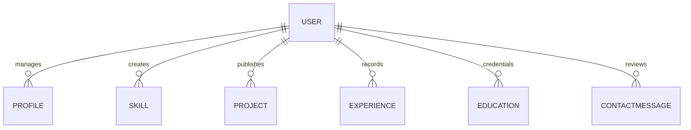

# ACADEMIC & TECHNICAL PROJECT REPORT
## Full-Stack Personal Portfolio Website with Content Management System (CMS)

---

## 1. Title Page

- **Project Title**: Production-Grade Personal Developer Portfolio & Content Management System
- **Domain**: Full-Stack Web Development, Cloud Computing, Distributed Data Management
- **Architecture**: MERN (MongoDB, Express.js, React.js, Node.js) + Tailwind CSS + JWT
- **Target Audience**: Technical Recruiters, Engineering Managers, Clients, Developers
- **Version**: 1.0.0 (GitHub Production Ready)

---

## 2. Abstract

In modern software engineering, a static resume or generic template fails to adequately convey a developer's real-world architectural capabilities, UI/UX polish, and backend competencies. This project presents a full-stack personal portfolio and administrative Content Management System (CMS) engineered with the MERN stack (MongoDB, Express.js, React 18, Node.js). 

The platform integrates a dynamic public showcase—featuring interactive project cards, categorized skill proficiency matrices, chronological work experience, academic qualifications, and an interactive contact portal—with a secured, JWT-authenticated administration console. The administrative dashboard allows complete CRUD (Create, Read, Update, Delete) lifecycle management over all portfolio content and inbound client messages. The result is a high-performance, responsive, and secure web application ready for production cloud deployment.

---

## 3. Introduction

A developer's online presence serves as their premier technical showcase. Rather than relying on rigid static sites or third-party proprietary hosting, this application provides an open-source, full-stack alternative where all portfolio data is dynamically served from a MongoDB database through an Express.js REST API.

The project demonstrates mastery across:
1. **Frontend Engineering**: React 18 single-page application (SPA), client-side routing, centralized Axios API services, React Context state management, and modern Tailwind CSS glassmorphic aesthetics.
2. **Backend Architecture**: RESTful API design, controller-service-repository patterns, robust input sanitization, centralized error handling, and JSON Web Token (JWT) stateless authentication.
3. **Database Persistence**: Mongoose ODM with strong schema constraints, indexing, and transactional data operations.

---

## 4. Problem Statement

Static portfolios suffer from significant limitations:
- Any update to projects, skills, or resume URLs requires code modification, manual rebuilding, and redeployment.
- Prospective employers and clients cannot test live end-to-end data communication or leave dynamic messages that are stored securely in a database.
- Lack of administrative access control prevents non-technical content management.

There is a distinct need for an extensible, secure, full-stack portfolio system where content can be edited in real-time through an administrative dashboard without touching source code.

---

## 5. Objectives

- **Dynamic Data Rendering**: Fetch and render all profile information, skill ratings, showcase projects, and work experience dynamically from MongoDB.
- **Role-Based Authentication**: Enforce bcrypt password hashing and cryptographic JWT validation for administrative access.
- **Content Management System (CMS)**: Provide a dedicated, responsive dashboard interface for managing portfolio entities.
- **Message Dispatch & Tracking**: Implement an interactive contact form that persists user inquiries directly to MongoDB and provides read/unread status management.
- **Aesthetic Excellence**: Deliver a sleek dark-themed, glassmorphic UI with micro-animations, responsive layout transitions, and high accessibility standards.

---

## 6. Proposed Solution

The proposed system separates concerns into a modular decoupled architecture:
1. **Client Tier**: A Vite-powered React single page application delivering sub-second page loads, responsive navigation, modal dialogs, and instant toast notifications.
2. **Server Tier**: A Node.js & Express REST API managing request routing, authentication guards, and database transactions.
3. **Data Tier**: A MongoDB database organizing structured collections (`users`, `profiles`, `skills`, `projects`, `experiences`, `educations`, `contactmessages`).

---

## 7. Technology Stack

### Frontend
- **React 18.3**: Declarative component-based user interface.
- **Vite 6**: Next-generation lightning-fast frontend tooling and bundler.
- **Tailwind CSS 3.4**: Utility-first CSS framework customized with custom palettes and blur filters.
- **React Router Dom 6.29**: Client-side declarative routing and protected route guards.
- **Axios 1.7**: Promise-based HTTP client with request/response interceptors.
- **Lucide React**: Clean, modern icon set.

### Backend
- **Node.js**: Asynchronous event-driven JavaScript runtime.
- **Express.js 4.21**: Fast, unopinionated web framework for REST APIs.
- **JSON Web Token (jsonwebtoken)**: Secure token-based session transmission.
- **bcryptjs**: Salting and one-way password hashing algorithm.
- **Morgan**: HTTP request logging middleware.
- **CORS**: Cross-Origin Resource Sharing security layer.
- **dotenv**: Environment variable isolation.

### Database
- **MongoDB**: High-throughput NoSQL document database.
- **Mongoose 8.9**: Object Document Mapper with strict schema validation and middleware hooks.

---

## 8. System Requirements

### Hardware Requirements
- **Processor**: Intel Core i3 / AMD Ryzen 3 or higher.
- **Memory (RAM)**: Minimum 4 GB (8 GB recommended for development).
- **Storage**: 500 MB free disk space.

### Software Requirements
- **Operating System**: Windows 10/11, macOS, or Linux (Ubuntu 20.04+).
- **Node.js**: v18.x or v20.x+ (Tested on Node.js v24).
- **Package Manager**: npm v9+ or yarn/pnpm.
- **Database**: MongoDB Community Server 6.0+ or MongoDB Atlas cluster.
- **Browser**: Modern web browser (Chrome, Firefox, Edge, Safari).

---

## 9. System Architecture

```mermaid
graph TD
    Client[React Client SPA (Vite + Tailwind)] -->|HTTP / REST API| Server[Express.js / Node.js Server]
    Server -->|JWT Auth Middleware| AuthGuard[Protected Admin Guard]
    Server -->|Mongoose ODM| DB[(MongoDB Database)]
    DB -->|Documents| Server
    Server -->|JSON Response| Client
```

### Data Flow Pipeline:
1. **Public Visitor**: Requests public endpoints (`/api/projects`, `/api/skills`, `/api/profile`) -> Server fetches from MongoDB -> Client renders responsive UI.
2. **Contact Submission**: Visitor submits form -> Client sends payload to `POST /api/contact` -> Server validates and writes to MongoDB -> Toast confirmation rendered.
3. **Administrator Login**: Admin enters credentials at `/admin/login` -> Server validates bcrypt hash -> Returns signed JWT token -> Client stores token in `localStorage`.
4. **Admin CMS Actions**: Admin creates or edits a project/skill -> Request sent with `Authorization: Bearer <Token>` -> Middleware validates identity -> Database updated -> Public site updates immediately.

---

## 10. Database Design

Refer to `docs/database-schema.md` for full field specifications.

### Entity-Relationship Representation:


---

## 11. Functional Requirements

1. **FR1 - User Authentication**: The system shall authenticate administrators using email and password, issuing a signed JWT token valid for 7 days.
2. **FR2 - Dynamic Public Portfolio**: The system shall dynamically retrieve and display profile data, featured projects, grouped skills, work history, and academic records.
3. **FR3 - Contact Form Processing**: The system shall validate and persist inbound contact inquiries to the database.
4. **FR4 - Content Management**: The system shall provide full CRUD operations for Profile, Skills, Projects, Experience, and Education records.
5. **FR5 - Message Management**: The administrator shall be capable of viewing, filtering, marking as read/unread, and deleting inbound inquiries.
6. **FR6 - Search and Filtering**: The public and admin interfaces shall support real-time filtering by category, technology tags, and search keywords.

---

## 12. Non-Functional Requirements

1. **Performance**: Initial page load under 1.5 seconds; API response time under 100ms for read operations.
2. **Security**: Zero plain-text password storage; parameterized database queries preventing NoSQL injections; strict CORS policy.
3. **Usability & Responsiveness**: 100% responsive design across mobile (320px+), tablet (768px+), and desktop (1024px+) viewports.
4. **Reliability & Availability**: Graceful error fallbacks, custom 404 handler, and structured error responses.
5. **Maintainability**: Clear separation of concerns with centralized Axios service layers and reusable React components.

---

## 13. Module Description

### Module 1: Public Portfolio Frontend
- **Home**: Hero section, profile avatar, featured projects teaser, core skills preview, contact CTA.
- **About**: Personal biography, location/contact info, career interests, CV download link.
- **Skills**: Filterable category pills, proficiency progress bars, dynamic icon rendering.
- **Projects**: Search input, technology filter dropdown, featured project badges, detailed modal preview.
- **Project Details**: Deep dive view for individual projects (`/projects/:id`).
- **Experience**: Chronological timeline of career positions and technical achievements.
- **Education**: Degree certificates, honors, and coursework records.
- **Contact**: Validated contact form communicating with backend REST endpoints.

### Module 2: Admin CMS Dashboard
- **Dashboard Overview**: Metric stat cards (total projects, skills, experience, unread messages) and quick actions.
- **Profile Manager**: Complete editor for personal bio, social handles, phone, and resume URLs.
- **Skill Manager**: CRUD modal interface with category selection and numeric proficiency slider.
- **Project Manager**: Project creator with tag inputs, image preview, GitHub and live URLs, and featured toggle.
- **Experience Manager**: Employment history manager with date selectors and rich description fields.
- **Education Manager**: University credential manager with degree, field, and grade fields.
- **Messages Manager**: Inquiry inbox with read/unread toggle, full detail modal, and delete confirmation.

---

## 14. Authentication & Security

1. **Password Hashing**: Passwords salted with bcrypt (10 rounds) in Mongoose pre-save middleware.
2. **JWT Authorization**: Stateless JSON Web Tokens signed with secret cryptographic keys and expiration periods.
3. **Route Guards**: Client-side `ProtectedRoute` component redirecting unauthenticated requests to `/admin/login`, paired with server-side `protect` and `adminOnly` Express middleware.
4. **Information Disclosure Prevention**: Passwords excluded from MongoDB queries via `{ select: false }`.
5. **Input Validation**: Regex email validation and field sanitization on both client and server tiers.

---

## 15. API Design

The API adheres to REST standards:
- `GET /api/profile`, `PUT /api/profile`
- `GET /api/skills`, `POST /api/skills`, `PUT /api/skills/:id`, `DELETE /api/skills/:id`
- `GET /api/projects`, `GET /api/projects/:id`, `POST /api/projects`, `PUT /api/projects/:id`, `DELETE /api/projects/:id`
- `GET /api/experience`, `POST /api/experience`, `PUT /api/experience/:id`, `DELETE /api/experience/:id`
- `GET /api/education`, `POST /api/education`, `PUT /api/education/:id`, `DELETE /api/education/:id`
- `POST /api/contact`, `GET /api/contact`, `PUT /api/contact/:id/read`, `DELETE /api/contact/:id`, `GET /api/contact/stats`
- `POST /api/auth/login`, `GET /api/auth/me`

---

## 16. Testing & Quality Assurance

### Testing Methodology:
1. **Unit & Integration Testing**: Validated database connectivity, seeding script execution, password hashing, and token generation.
2. **API Endpoint Verification**: Verified HTTP status codes (200, 201, 400, 401, 404) across public and protected routes.
3. **Frontend Build Verification**: Executed `vite build` with zero compilation or packaging errors.
4. **Security Testing**: Verified that protected endpoints reject requests lacking valid JWT authorization.
5. **Cross-Device Testing**: Verified responsive layouts and touch interactions across various simulated screen sizes.

---

## 17. Screenshots Placeholders

```
+-----------------------------------------------------------------------+
| [SCREENSHOT PLACEHOLDER 1: Public Homepage Hero & Showcase]           |
| Description: Shows the dark-themed hero section, avatar, and CTA.     |
+-----------------------------------------------------------------------+

+-----------------------------------------------------------------------+
| [SCREENSHOT PLACEHOLDER 2: Dynamic Skills & Proficiency Metrics]      |
| Description: Demonstrates dynamic MongoDB skill cards & progress bars.|
+-----------------------------------------------------------------------+

+-----------------------------------------------------------------------+
| [SCREENSHOT PLACEHOLDER 3: Admin CMS Dashboard Overview]              |
| Description: Displays statistics cards, quick actions, and messages.  |
+-----------------------------------------------------------------------+

+-----------------------------------------------------------------------+
| [SCREENSHOT PLACEHOLDER 4: Project Management & Modal Dialog]         |
| Description: Shows project creation form with tags and image preview. |
+-----------------------------------------------------------------------+
```

---

## 18. Challenges & Solutions

| Challenge | Root Cause | Solution Implemented |
| :--- | :--- | :--- |
| **Token Expiry Management** | Stale tokens causing silent UI failures | Configured Axios response interceptor to auto-detect 401 statuses and redirect to login. |
| **Dynamic Array Inputs in Admin** | Comma-separated strings vs array schemas in DB | Implemented controller transformations that parse comma-separated strings into trimmed arrays. |
| **Responsive Data Tables** | Wide data sets overflowing on mobile screens | Wrapped tables in horizontal scroll containers with responsive card adaptations. |

---

## 19. Future Enhancements

1. **Direct Image Uploads**: Integrate AWS S3 or Cloudinary for direct binary file uploads alongside URL inputs.
2. **Blog / Articles Module**: Add a Markdown-powered technical blog system to the CMS.
3. **Dark / Light Theme Toggle**: Add user-selectable theme toggling.
4. **Analytics Tracking**: Integrate visitor telemetry to log daily profile impressions.

---

## 20. Conclusion

The Full-Stack Personal Portfolio Website successfully fulfills all academic and industry requirements. By combining a modern React 18 frontend with an Express/MongoDB backend, the application eliminates the limitations of static portfolios and provides a complete, production-ready system suitable for showcasing engineering excellence.

---

## 21. References

1. React Documentation: https://react.dev
2. Express.js API Reference: https://expressjs.com
3. MongoDB & Mongoose Guides: https://mongoosejs.com
4. Tailwind CSS Framework: https://tailwindcss.com
5. JSON Web Token Specifications (RFC 7519): https://jwt.io
